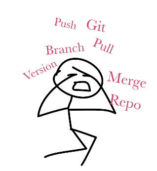
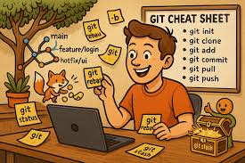
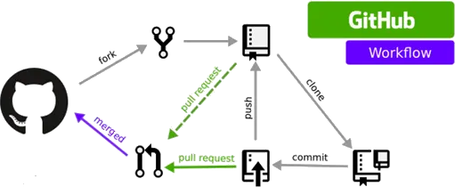
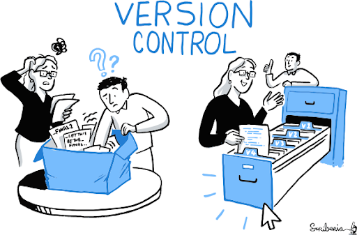
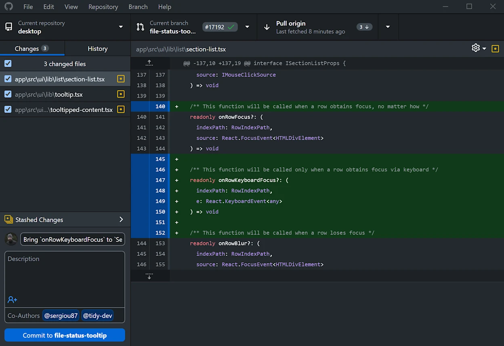
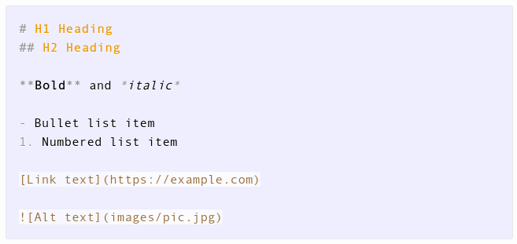
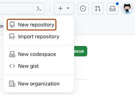

## Overwhelmed with git?

:::: {.columns}
::: {.column width="50%"}

:::
::: {.column width="50%"}
- Do you see people using Git in your field?
- Do you feel overwhelmed with all the Git info online?
- You’re not alone! Many beginners feel like this.
- After these ten rules, you will have taken the first step.

### Actionable items
- Write down one situation where version control could help your work.
:::
::::

## 1: Why Git and GitHub?
### Modern way to collaborate and work.

:::: {.columns}
::: {.column width="50%"}

:::
::: {.column width="50%"}
- Present your work in a professional and reusable way.
- Help your future self and others continue a project.
- See who changed what, when, and why.
- Work collaboratively.
- Discuss ideas, request feedback, and keep decisions in one place.

### Actionable items
- Create a GitHub account: [github.com](https://github.com)
:::
::::

## 2: What is Version Control?
### You will always save another version.

:::: {.columns}
::: {.column width="50%"}

:::
::: {.column width="50%"}
- Versioning and backup of files is important.
- Collaborative editing needs a shared history.
- Track changes and roll back when needed.
- Avoid file names like `final_final_really_final.docx`.

### Actionable items
- Reflect: How do you back up your files?
- Reflect: How do you handle different versions?
:::
::::

## 3: Simple Git Glossary
### Basic terms to work with Git.

:::: {.columns}
::: {.column width="50%"}

:::
::: {.column width="50%"}
- **Repository:** project folder tracked by Git.
- **Commit:** saved snapshot of changes.
- **Branch:** separate line of development.
- **Pull request:** proposal to review and merge changes.
- **Merge:** combine changes from one branch into another.

### Actionable items
- Explain the basic Git terms to a partner.
:::
::::

## 4: Workflow
### What is a typical Git workflow?

:::: {.columns}
::: {.column width="50%"}

:::
::: {.column width="50%"}
- **clone:** get a local copy.
- **work:** make some changes.
- **commit:** save your changes.
- **push:** publish your changes.
- **pull:** get changes from collaborators.

### Actionable items
- Play a beginner exercise: [GitHub Skills](https://learn.github.com/skills)
:::
::::

## 5: Best Practices for Smooth Collaboration
### How to behave when working with others on files.

:::: {.columns}
::: {.column width="50%"}

:::
::: {.column width="50%"}
- **Write clear commit messages** — future you will thank present you.
- **Make small, focused pull requests** — easier to review.
- Use **file and folder conventions**, e.g. `images/`, `docs/`.
- Agree on **branch names**, e.g. `feature-topic`, `fix-typo`.
- Add a `CONTRIBUTING.md` with house rules and style guide.

### Actionable items
- Explore a repository: [awesome-research](https://github.com/emptymalei/awesome-research)
- Explore an introduction to organizing files.
:::
::::

## 6: Tools
### Experience Git without the struggle.

:::: {.columns}
::: {.column width="50%"}

:::
::: {.column width="50%"}
- **Explorer:** GitHub webpage.
- **New:** GitHub Desktop GUI.
- **Intermediate:** IDE integration, e.g. VS Code or PyCharm.
- **Advanced:** Git command line.

### Actionable items
- Download GitHub Desktop.
- Clone your repository locally.
- Change the Markdown file.
:::
::::

## 7: Markdown
### Simple format which rules the world.

:::: {.columns}
::: {.column width="50%"}

:::
::: {.column width="50%"}
- Markdown is **plain text with a few symbols** that turn into formatting.
- It is widely used in GitHub projects, documentation, websites, and AI workflows.
- Markdown files work very well with Git because they are text-based.

### Actionable items
- Do the 10-minute tutorial: [CommonMark](https://commonmark.org/help/tutorial/)
:::
::::

## 8: Your First Repository
### Create your GitHub landing page.

:::: {.columns}
::: {.column width="50%"}

:::
::: {.column width="50%"}
- **Name** it, e.g. `docs-site`.
- Check **“Add a README”** so the repository is not empty.
- Choose **“Public”** or **“Private”**.
- Click **Create repository**.

### Actionable items
- Create your first repository.
:::
::::

## 9: Outreach
### Use Git to show your work.

:::: {.columns}
::: {.column width="50%"}

:::
::: {.column width="50%"}
- Show your work and portfolio.
- Get credit for your work.
- Make projects easier to find, reuse, and cite.
- Use GitHub Pages to publish project documentation or a personal landing page.

### Actionable items
- Create a landing page for your GitHub account.
:::
::::

## 10: What to do next?
### Your journey just started, where to go next?

:::: {.columns}
::: {.column width="50%"}

:::
::: {.column width="50%"}
- Find a person who uses Git in your lab or institution.
- Search for `your institution + GitHub`.
- Show your first repository to your colleagues.
- Become a contributor for a GitHub repository you like.
- Congrats! You are now a Git user!

### Actionable items
- Talk to one Git user in your institution.
- Share your first repository.
:::
::::

## References
::: {#refs}
:::

## Contact
::: {style="text-align: center; margin-top: 0.5em"}
::: {.columns}

::: {.column width="50%"}
[{.fixed-img}](https://livermetabolism.com){.fixed-img}

[https://livermetabolism.com](https://livermetabolism.com)
:::
::: {.column width="50%"}
{.fixed-img}

[koenigmx@hu-berlin.de](mailto:koenigmx@hu-berlin.de)
:::

:::
:::
