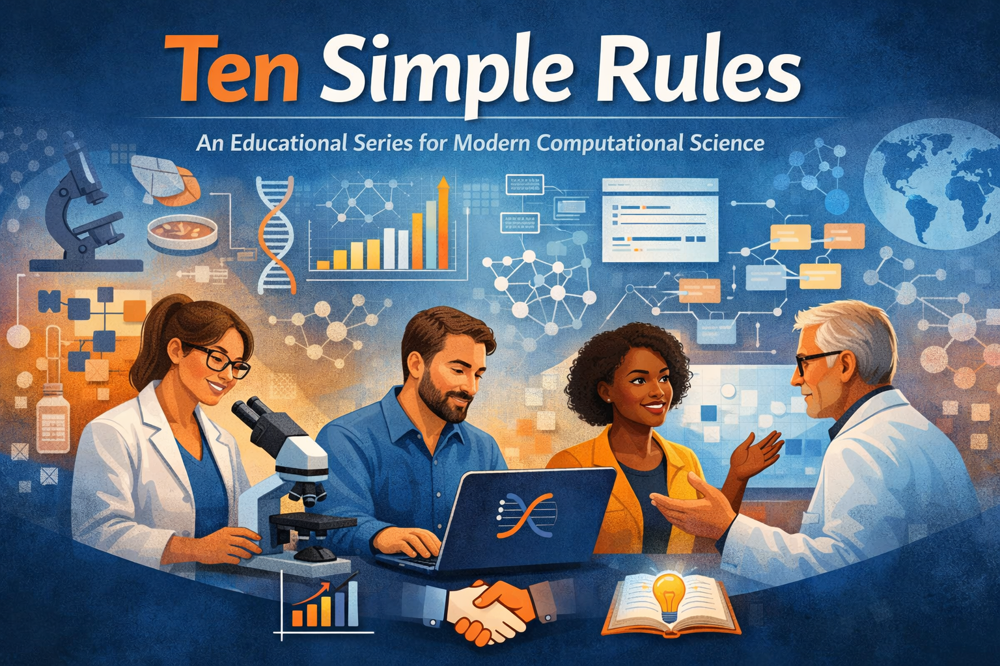

# Ten Simple Rules – An Educational Series for Modern Computational Science

The **Ten Simple Rules** educational series is a curated program designed to support researchers, students, and educators in navigating the practical realities of modern computational and data-driven science.

Building on the well-known *Ten Simple Rules* articles published in *PLOS*, this series translates widely adopted best practices into **concise, actionable guidance** for everyday research, teaching, and collaboration. The focus is not only on *what* to do, but *how* to do it well—across the full research lifecycle.



## Installation
Install quarto from https://quarto.org/

## Render website and presentations
### preview
```bash
quarto preview
```

### render
```bash
quarto render
```

## License
- Source Code: [MIT](https://opensource.org/license/MIT)
- Documentation: [CC BY-SA 4.0](http://creativecommons.org/licenses/by-sa/4.0/)

## Funding
Matthias König is supported and by the German Research Foundation (DFG) within the Research Unit Programme FOR 5151
"QuaLiPerF (Quantifying Liver Perfusion-Function Relationship in Complex Resection -
A Systems Medicine Approach)" by grant number 436883643 and by grant number
465194077 (Priority Programme SPP 2311, Subproject SimLivA).

Matthias König was supported by the Federal Ministry of Education and Research (BMBF, Germany)
within the research network Systems Medicine of the Liver (LiSyM, grant number 031L0054).

© 2026 Matthias König